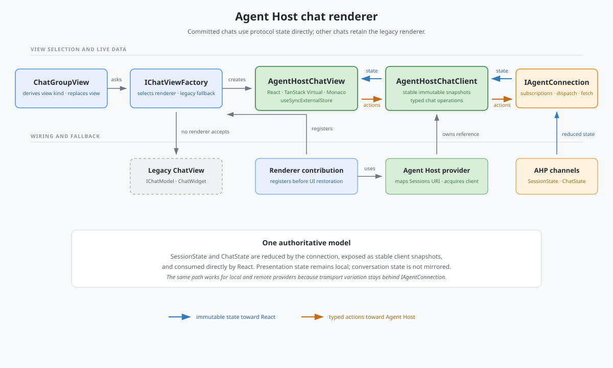
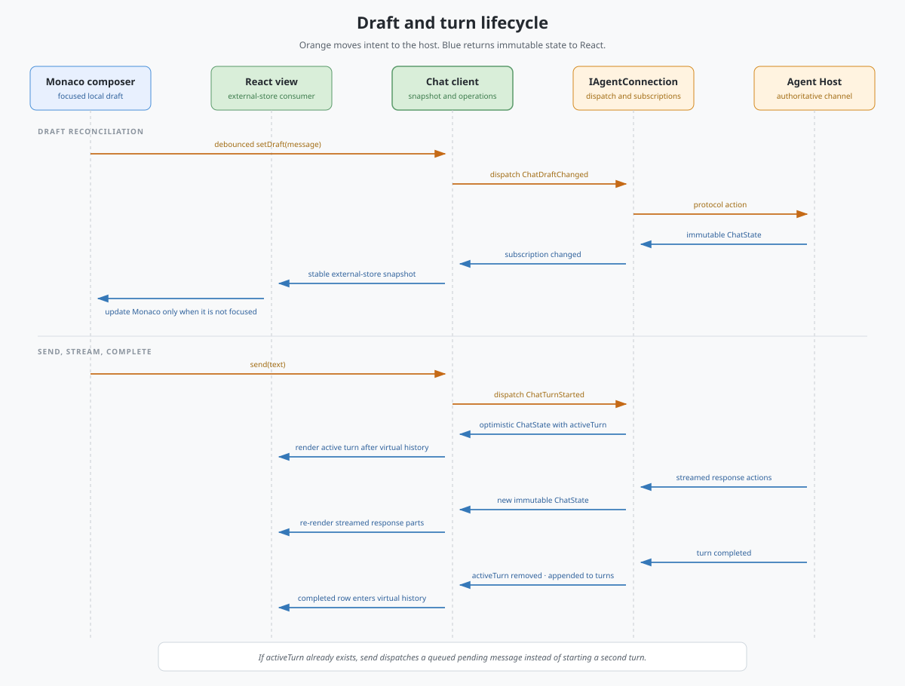

# Agent Host chat renderer

This document describes the implementation flow for committed Agent Host chats in the Agents Window. The provider contract remains in [AGENT_HOST_SESSIONS_PROVIDER.md](./AGENT_HOST_SESSIONS_PROVIDER.md); this document focuses on how a selected chat becomes a React view, how protocol state reaches that view, and how user actions return to the Agent Host.

## Architecture and ownership

The renderer is intentionally side-by-side with the legacy chat stack:

1. `ChatGroupView` derives the desired view kind from the active `ISession` and `IChat`.
2. `IChatViewFactory` asks registered renderers whether they can render that combination.
3. `AgentHostChatRendererContribution` accepts only committed chats whose provider implements `IAgentHostSessionsProvider` and can resolve the chat to a live Agent Host resource.
4. The contribution acquires an `AgentHostChatClient` from the provider and creates `AgentHostChatView`.
5. If no registered renderer accepts the chat, the factory creates the legacy `ChatView`, which continues to own `IChatModel` and `ChatWidget`.

New-session and untitled peer-chat views deliberately remain on the legacy creation path. Their workspace selection, configuration, and draft-graduation responsibilities are independent of committed transcript rendering.

## Authoritative resources

The Sessions resource and the Agent Host resource are different identities:

- Sessions presents `<provider-scheme>:/<session-id>[#<chat-id>]`.
- `BaseAgentHostSessionsProvider.getBackendChatResource` resolves that facade through the latest `SessionState`.
- The default chat comes from `SessionState.defaultChat`; peer chats are resolved from their host-provided `ChatSummary.resource`.
- The provider never constructs a backend chat URI from the Sessions URI. The host-provided resource remains authoritative.

`AgentHostChatClient` receives both the backend session resource and backend chat resource. It acquires `SessionState` and `ChatState` subscription references from `IAgentConnection` and disposes them with the client reference owned by the view.

## State flowing into React

`SessionState` and `ChatState` are the only conversation store. There is no mirrored Zustand store or React reducer.

1. `IAgentConnection` subscriptions reduce local and remote protocol actions into immutable state objects.
2. `AgentHostChatClient.getSnapshot()` returns one of `loading`, `error`, or `ready`.
3. Ready snapshots contain the current protocol `SessionState` and `ChatState` objects without translating the conversation into a second model.
4. The client preserves snapshot identity while the underlying state object identities are unchanged.
5. `AgentHostChatApp` connects the client to React with `useSyncExternalStore`.
6. A subscription change invalidates the external-store snapshot and React renders the new immutable state.

React owns only presentation state such as composer errors, scroll-stickiness, whether the transcript is near its top, and whether input validation is visible. Structured-input answers are dispatched as protocol state as they change rather than being mirrored in a React form store.

React, React DOM, and TanStack Virtual enter Sessions through `browser/browserRuntime.ts`. Production entry-point bundles inline that dependency closure. Development transpilation replaces the emitted runtime module with one browser-ready bundle and the renderer imports it by relative URL, so Electron and web development hosts share one React instance without requiring host-specific import maps.

## Transcript layout

`ChatState` is rendered in three regions:

| State | Rendering strategy | Reason |
|-------|--------------------|--------|
| `turns` | TanStack Virtual completed-history window | Completed turns are stable and may be numerous. |
| `activeTurn` | Ordinary React content after the virtual window | Streaming updates do not invalidate or remeasure the completed-history window. |
| `queuedMessages` | Ordinary React content after the active turn | The queued tail stays visible and ordered while the current turn runs. |

When screen-reader-optimized mode is enabled, the completed-history virtualizer is disabled and the complete transcript is rendered into the accessibility tree. Virtualized rows otherwise expose `aria-setsize` and `aria-posinset`.

Agent-authored Markdown is treated as untrusted and rendered with `ChatContentMarkdownRenderer`. Protocol response parts are rendered directly by kind, including reasoning, tool calls and confirmations, input requests, errors, notifications, and content references. An unknown future kind produces a visible unsupported-response error rather than disappearing.

Completed and running tool calls use compact progress rows in the transcript. A tool call awaiting confirmation, a tool result awaiting review, or an unresolved structured input request is blocking: the transcript keeps a subdued marker at the response part's stream position, while the actionable prompt replaces the Monaco composer at the bottom of the view. If more than one blocking part is pending, the latest prompt is shown first and resolving it reveals the preceding prompt. Read-only views keep blocking parts inline because they do not expose response controls or a composer.

### Structured input

Structured input uses the same VS Code controls as the workbench: `InputBox`, custom-drawn `SelectBox`, and `Checkbox`. Each React adapter creates the widget through `IInstantiationService`, owns its widget and event-listener disposables for exactly one mount, and reconciles immutable protocol updates without replacing text in a focused field.

Displayed values resolve in this order:

1. the current protocol answer;
2. the question's declared default;
3. a recommended select option; and
4. the empty value for the question kind.

Selecting or editing a value dispatches `ChatInputAnswerChanged` immediately. **Continue** validates required values, text length and format, numeric bounds and integer constraints, selection-count bounds, and allowed freeform answers. The first invalid control receives focus, its inline validation is revealed, and the error is announced. A valid submission fills any visible defaults, marks non-skipped answers as submitted, and dispatches `ChatInputRequestCompleted`.

When a blocking prompt replaces the composer, focus moves to its first interactive control. When the prompt is resolved while focus remains inside it, focus returns to the recreated composer.

## Draft, send, and streaming flow

### Draft reconciliation

The Monaco composer is initialized from `ChatState.draft`. Local edits are debounced and dispatched as `ChatDraftChanged`; blur and disposal flush a pending change. When a new remote draft arrives, React updates Monaco only when the editor does not have text focus, preventing a subscription update from overwriting an in-progress local edit.

The draft also carries the selected model, selected agent, and attachments. Resource attachments are translated with `connection.resourceUris.toAgentHost` before they enter protocol state.

Committed chats host the shared workbench model-picker widget below Monaco. Its delegate reads the owning provider's model snapshot and writes through `ISessionsProvider.setModel` with the exact chat resource rendered by the view, so selecting a model affects the next message in that conversation without changing peer chats.

### Starting or queueing a turn

`AgentHostChatClient.send`:

1. runs any provider preparation hook;
2. requires a ready snapshot;
3. rejects read-only or hidden chats;
4. creates a user `Message`, preserving model and agent values from the latest draft;
5. dispatches `ChatTurnStarted` when no turn is active; or
6. dispatches `ChatPendingMessageSet` with `PendingMessageKind.Queued` when a turn is already active.

Dispatch is optimistic: the connection reducer publishes the new immutable `ChatState` immediately, and the same subscription path updates React before the Agent Host responds.

Direct renderer sends and programmatic sends prepared by the compatibility chat adapter converge on the shared Agent Host turn-submission helpers for `ChatTurnStarted` and `ChatTurnCancelled`. Admission, outgoing-turn contributions, native turn telemetry, provider invocation, and turn-end checkpoint and changeset work are host-side consequences of those protocol actions; the React renderer does not duplicate or bypass them. The compatibility adapter still owns legacy variable-to-attachment conversion and progress projection for its callers.

### Streaming and completion

Agent Host actions update `ChatState.activeTurn` as response parts stream. Each immutable state replacement follows the same subscription-to-snapshot path. On completion, protocol state removes `activeTurn` and appends the completed turn to `turns`; the next render therefore moves it from the live tail into virtualized history without a separate client-side reconciliation model.

Cancellation, resume, truncation, tool confirmation, tool-result confirmation, input-answer changes, and input completion all dispatch typed chat actions through the same backend chat resource.

## Pagination and scroll anchoring

Older history is available when `ChatState.turnsNextCursor` is set.

1. Approaching the top of the transcript or activating **Load Older Messages** calls `AgentHostChatClient.loadOlderTurns`.
2. The client deduplicates concurrent loads and calls `IAgentConnection.fetchTurns` with the authoritative chat channel and cursor.
3. The connection merges the returned page into its chat subscription state.
4. Before loading, the view records `scrollHeight` and `scrollTop`.
5. After React commits the older rows, the view adds the increase in `scrollHeight` to `scrollTop`, preserving the message that was visually anchored before the page arrived.

Failures remain visible in the transcript and are announced through the ARIA status channel.

## Interactivity and accessibility

`ChatState.interactivity` gates mutation at both layers:

- the view hides the composer and mutating response controls unless interactivity is full;
- the client independently rejects sends to read-only or hidden chats.

The transcript is keyboard focusable, icon-only composer actions have localized accessible names and managed hovers, and important state changes use concise ARIA status announcements. Historical errors are ordinary transcript content rather than live alerts, preventing virtualized rows from being re-announced when they remount.

The Agents Window's existing accessibility help provider describes the composer-replacing prompt behavior when this renderer is active. Its existing Accessible View identity and verbosity setting are also reused: `AgentHostChatView.getAccessibleContent()` serializes the current conversation into plain text, including user and agent messages, reasoning, tool status and errors, input questions and current/default answers, notifications, active output, and queued messages. The provider-neutral chat-view chain forwards that content from the focused renderer, and closing the Accessible View restores focus to the previous element or session view.

## Lifetime

The chat view owns the provider's `IAgentHostChatClientReference`. Disposing the view:

1. unmounts the React root;
2. disposes Monaco, its model, the resize observer, and draft scheduler;
3. disposes the client reference; and
4. releases the session and chat subscription references.

`ChatGroupView` replaces the current view when either the desired view kind or renderer ID changes, so switching between an untitled shell, a committed Agent Host chat, and a legacy chat also transfers ownership cleanly.

## Current MVP boundary

- Only committed Agent Host chats use this renderer.
- New-session and untitled peer-chat shells remain legacy.
- Programmatic provider sends still use compatibility request preparation and progress projection before entering the shared protocol turn-submission path.
- The regular Chat panel is unchanged.
- General typing of VS Code-specific protocol `_meta` values is intentionally deferred.

## Key implementation files

- [Renderer selection and replacement](../../../browser/parts/chatGroupView.ts)
- [Provider-neutral renderer registry](../../../services/chatView/browser/chatViewFactory.ts)
- [Renderer registration](./browser/chat/agentHostChatRenderer.contribution.ts)
- [Protocol-native client](./browser/chat/agentHostChatClient.ts)
- [React view and Monaco composer](./browser/chat/agentHostChatView.tsx)
- [Provider resource mapping and client acquisition](./browser/baseAgentHostSessionsProvider.ts)
